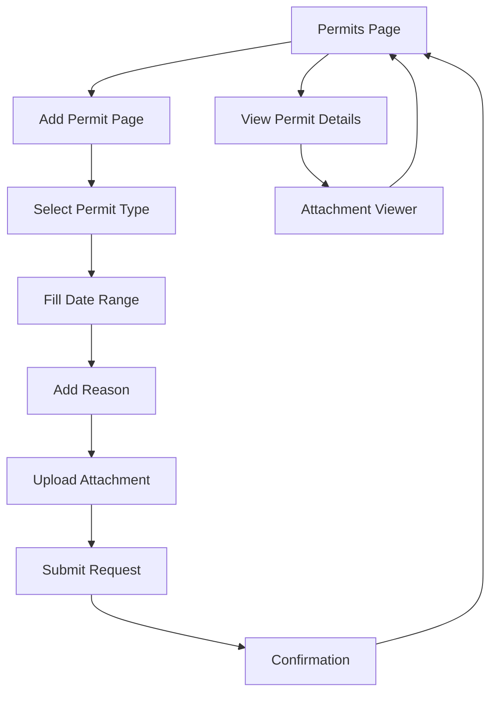

# Product Requirements Document - Permits Feature Update

## 1. Product Overview

Pembaruan fitur permits untuk memiliki tampilan dan fungsionalitas yang identik dengan fitur leaves yang sudah ada. Fitur permits akan menyediakan sistem pengajuan izin yang komprehensif dengan antarmuka pengguna yang konsisten dan pengalaman yang familiar bagi pengguna.

Tujuan utama adalah menciptakan konsistensi dalam pengalaman pengguna antara fitur cuti (leaves) dan izin (permits), sehingga pengguna dapat dengan mudah beradaptasi dan menggunakan kedua fitur tersebut tanpa kebingungan.

## 2. Core Features

### 2.1 User Roles

| Role | Registration Method | Core Permissions |
|------|---------------------|------------------|
| Employee | Login dengan akun existing | Dapat mengajukan permits, melihat riwayat permits, upload attachment |
| Approver/Manager | Assigned by admin | Dapat menyetujui/menolak permits, melihat semua permits tim |
| Admin | System admin access | Full access ke semua permits, konfigurasi permit types |

### 2.2 Feature Module

Fitur permits akan terdiri dari halaman-halaman utama berikut:

1. **Permits Page**: halaman utama permits, daftar permits, summary card, navigasi ke form pengajuan
2. **Add Permit Page**: form pengajuan permit baru, pilihan jenis permit, upload attachment, validasi
3. **Attachment Viewer Page**: viewer untuk melihat lampiran permits yang telah diupload

### 2.3 Page Details

| Page Name | Module Name | Feature description |
|-----------|-------------|---------------------|
| Permits Page | Header Section | Display page title "Permohonan Izin", subtitle, back navigation button |
| Permits Page | Summary Card | Show total permits count, gradient background, "Ajukan Izin" button |
| Permits Page | Permits List | Display all permits with status, date range, permit type, approver info |
| Permits Page | Refresh Indicator | Pull-to-refresh functionality to reload permits data |
| Permits Page | Empty State | Show empty state when no permits available |
| Permits Page | Loading State | Show loading indicator while fetching data |
| Permits Page | Error State | Display error message with retry option |
| Add Permit Page | Header Section | Page title, back navigation, progress indicator |
| Add Permit Page | Permit Type Selector | List of available permit types with selection functionality |
| Add Permit Page | Date Fields | Start date and end date pickers with validation |
| Add Permit Page | Reason Field | Text area for permit reason with character limit |
| Add Permit Page | Attachment Field | File picker for uploading supporting documents |
| Add Permit Page | Submit Button | Submit permit request with validation and loading state |
| Add Permit Page | Form Validation | Real-time validation for all required fields |
| Attachment Viewer Page | Image Viewer | Display uploaded images with zoom functionality |
| Attachment Viewer Page | Document Viewer | Display PDF and other document types |
| Attachment Viewer Page | Navigation Controls | Back button, share options, download functionality |

## 3. Core Process

### Employee Flow
1. Employee membuka aplikasi dan navigasi ke halaman Permits
2. Melihat summary card dengan total permits dan tombol "Ajukan Izin"
3. Melihat daftar permits yang sudah diajukan dengan status masing-masing
4. Untuk mengajukan permit baru, klik tombol "Ajukan Izin"
5. Pilih jenis permit dari daftar yang tersedia
6. Isi tanggal mulai dan selesai permit
7. Isi alasan permit (opsional)
8. Upload attachment jika diperlukan
9. Submit permit request
10. Menerima konfirmasi pengajuan berhasil
11. Dapat melihat status permit di halaman utama

### Approver Flow
1. Approver menerima notifikasi permit baru
2. Melihat detail permit yang diajukan
3. Review attachment jika ada
4. Approve atau reject permit dengan alasan
5. Employee menerima notifikasi hasil approval

## 4. User Interface Design

### 4.1 Design Style

- **Primary Colors**: 
  - Gradient: #1e3c72 to #2a5298 (header background)
  - Primary: #4facfe to #00f2fe (accent elements)
  - White: #FFFFFF (card backgrounds)
- **Button Style**: Rounded corners (16px radius), elevated with subtle shadows
- **Font**: Google Fonts Poppins
  - Headers: 24px, weight 700
  - Subheaders: 18px, weight 600
  - Body text: 14-16px, weight 400
  - Small text: 12-13px, weight 400
- **Layout Style**: Card-based design with gradient backgrounds, consistent spacing (16px, 20px, 24px)
- **Icons**: Material Design rounded icons, consistent sizing (20px, 24px, 28px)

### 4.2 Page Design Overview

| Page Name | Module Name | UI Elements |
|-----------|-------------|-------------|
| Permits Page | Header | Gradient background (#1e3c72 to #2a5298), white text, back button with semi-transparent background |
| Permits Page | Summary Card | Gradient card (#1e3c72 to #3b82c9), white text, icon container, CTA button with white background |
| Permits Page | Permit Cards | White background, rounded corners (24px), subtle shadow, status badges with colored backgrounds |
| Add Permit Page | Form Container | White background, rounded top corners, full-height scrollable content |
| Add Permit Page | Input Fields | Outlined text fields, consistent padding, validation states with color indicators |
| Add Permit Page | Type Selector | List items with selection states, checkmark indicators, consistent typography |
| Attachment Viewer | Viewer Container | Full-screen overlay, dark background, centered content with navigation controls |

### 4.3 Responsiveness

- **Desktop-first approach** dengan adaptasi mobile
- **Touch interaction optimization** untuk semua interactive elements
- **Responsive breakpoints** untuk berbagai ukuran layar
- **Consistent spacing** menggunakan sistem 8px grid
- **Flexible layouts** dengan proper constraints dan flex properties