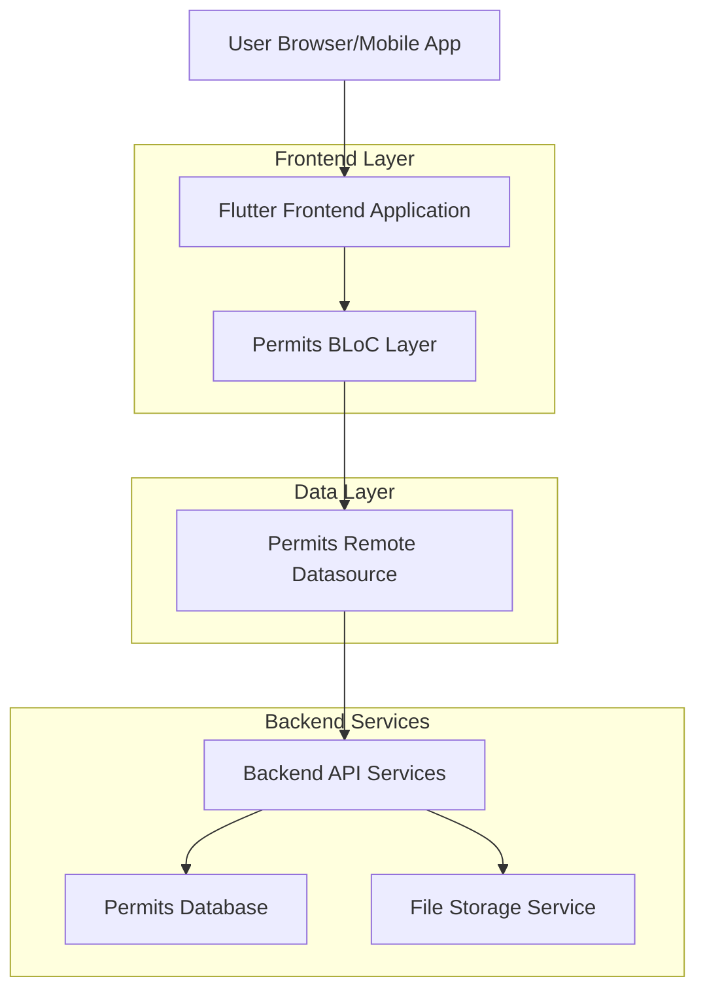
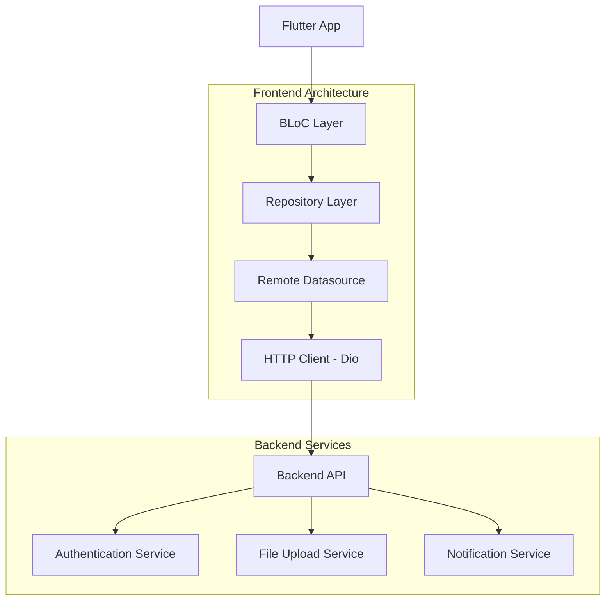
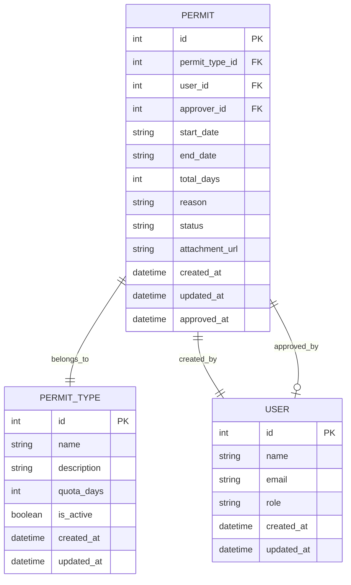
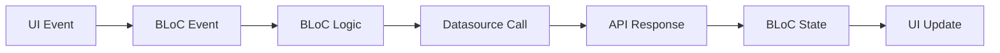

# Technical Architecture Document - Permits Feature

## 1. Architecture Design



## 2. Technology Description

* Frontend: <Flutter@3.x> + <flutter_bloc@8.x> + <freezed@2.x> + google\_fonts + intl

* State Management: BLoC Pattern dengan flutter\_bloc

* HTTP Client: Dio untuk API calls

* File Handling: image\_picker + file\_picker untuk attachment upload

* Code Generation: freezed + json\_annotation untuk immutable classes

## 3. Route Definitions

| Route                      | Purpose                                                       |
| -------------------------- | ------------------------------------------------------------- |
| /permits                   | Halaman utama permits, menampilkan daftar permits dan summary |
| /permits/add               | Halaman form pengajuan permit baru                            |
| /permits/attachment-viewer | Halaman viewer untuk melihat attachment permits               |

## 4. API Definitions

### 4.1 Core API

**Get All Permits**

```
GET /api/permits
```

Response:

| Param Name | Param Type | Description             |
| ---------- | ---------- | ----------------------- |
| status     | boolean    | Status response         |
| message    | string     | Response message        |
| data       | Permit\[]  | Array of permit objects |

**Get Permit Types**

```
GET /api/permit-types
```

Response:

| Param Name | Param Type    | Description                  |
| ---------- | ------------- | ---------------------------- |
| status     | boolean       | Status response              |
| message    | string        | Response message             |
| data       | PermitType\[] | Array of permit type objects |

**Create Permit**

```
POST /api/permits
```

Request:

| Param Name       | Param Type | isRequired | Description                         |
| ---------------- | ---------- | ---------- | ----------------------------------- |
| permit\_type\_id | int        | true       | ID jenis permit                     |
| start\_date      | string     | true       | Tanggal mulai permit (YYYY-MM-DD)   |
| end\_date        | string     | true       | Tanggal selesai permit (YYYY-MM-DD) |
| reason           | string     | false      | Alasan pengajuan permit             |
| attachment       | File       | false      | File lampiran                       |

Response:

| Param Name | Param Type | Description           |
| ---------- | ---------- | --------------------- |
| status     | boolean    | Status response       |
| message    | string     | Response message      |
| data       | Permit     | Created permit object |

**Get Permit Balance**

```
GET /api/permits/balance
```

Response:

| Param Name | Param Type    | Description                |
| ---------- | ------------- | -------------------------- |
| status     | boolean       | Status response            |
| message    | string        | Response message           |
| data       | PermitBalance | Permit balance information |

Example Request:

```json
{
  "permit_type_id": 1,
  "start_date": "2024-01-15",
  "end_date": "2024-01-16",
  "reason": "Keperluan keluarga",
  "attachment": "base64_encoded_file"
}
```

Example Response:

```json
{
  "status": true,
  "message": "Permit created successfully",
  "data": {
    "id": 123,
    "permit_type": {
      "id": 1,
      "name": "Izin Pribadi",
      "quota_days": 12
    },
    "start_date": "2024-01-15",
    "end_date": "2024-01-16",
    "total_days": 2,
    "reason": "Keperluan keluarga",
    "status": "pending",
    "attachment_url": "https://api.example.com/files/permit_123.pdf",
    "created_at": "2024-01-10T10:00:00Z"
  }
}
```

## 5. Server Architecture Diagram



## 6. Data Model

### 6.1 Data Model Definition



### 6.2 Data Definition Language

**Permit Table (permits)**

```sql
-- Create permits table
CREATE TABLE permits (
    id SERIAL PRIMARY KEY,
    permit_type_id INTEGER NOT NULL,
    user_id INTEGER NOT NULL,
    approver_id INTEGER,
    start_date DATE NOT NULL,
    end_date DATE NOT NULL,
    total_days INTEGER NOT NULL,
    reason TEXT,
    status VARCHAR(20) DEFAULT 'pending' CHECK (status IN ('pending', 'approved', 'rejected')),
    attachment_url VARCHAR(500),
    created_at TIMESTAMP WITH TIME ZONE DEFAULT NOW(),
    updated_at TIMESTAMP WITH TIME ZONE DEFAULT NOW(),
    approved_at TIMESTAMP WITH TIME ZONE,
    
    FOREIGN KEY (permit_type_id) REFERENCES permit_types(id),
    FOREIGN KEY (user_id) REFERENCES users(id),
    FOREIGN KEY (approver_id) REFERENCES users(id)
);

-- Create permit_types table
CREATE TABLE permit_types (
    id SERIAL PRIMARY KEY,
    name VARCHAR(100) NOT NULL,
    description TEXT,
    quota_days INTEGER DEFAULT 0,
    is_active BOOLEAN DEFAULT true,
    created_at TIMESTAMP WITH TIME ZONE DEFAULT NOW(),
    updated_at TIMESTAMP WITH TIME ZONE DEFAULT NOW()
);

-- Create indexes
CREATE INDEX idx_permits_user_id ON permits(user_id);
CREATE INDEX idx_permits_status ON permits(status);
CREATE INDEX idx_permits_created_at ON permits(created_at DESC);
CREATE INDEX idx_permits_approver_id ON permits(approver_id);
CREATE INDEX idx_permit_types_is_active ON permit_types(is_active);

-- Insert initial permit types
INSERT INTO permit_types (name, description, quota_days) VALUES
('Izin Pribadi', 'Izin untuk keperluan pribadi', 12),
('Izin Sakit', 'Izin karena sakit dengan surat dokter', 30),
('Izin Keluarga', 'Izin untuk keperluan keluarga mendesak', 6),
('Izin Dinas', 'Izin untuk keperluan dinas luar kantor', 0);

-- Grant permissions (if using Supabase)
GRANT SELECT ON permits TO anon;
GRANT ALL PRIVILEGES ON permits TO authenticated;
GRANT SELECT ON permit_types TO anon;
GRANT ALL PRIVILEGES ON permit_types TO authenticated;
```

## 7. BLoC Architecture

### 7.1 BLoC Structure

```
presentation/permits/bloc/
├── create_permit/
│   ├── create_permit_bloc.dart
│   ├── create_permit_event.dart
│   ├── create_permit_state.dart
│   └── create_permit_bloc.freezed.dart
├── get_all_permits/
│   ├── get_all_permits_bloc.dart
│   ├── get_all_permits_event.dart
│   ├── get_all_permits_state.dart
│   └── get_all_permits_bloc.freezed.dart
├── permit_balance/
│   ├── permit_balance_bloc.dart
│   ├── permit_balance_event.dart
│   ├── permit_balance_state.dart
│   └── permit_balance_bloc.freezed.dart
└── permit_type/
    ├── permit_type_bloc.dart
    ├── permit_type_event.dart
    ├── permit_type_state.dart
    └── permit_type_bloc.freezed.dart
```

### 7.2 State Management Flow



## 8. File Structure

```
lib/presentation/permits/
├── bloc/
│   ├── create_permit/
│   ├── get_all_permits/
│   ├── permit_balance/
│   └── permit_type/
└── pages/
    ├── permits_page.dart
    ├── add_permit_page.dart
    └── attachment_viewer_page.dart

lib/data/
├── datasources/
│   └── permit_remote_datasource.dart
└── models/
    ├── request/
    │   └── create_permit_request_model.dart
    └── response/
        ├── permit_response_model.dart
        └── permit_type_response_model.dart
```

